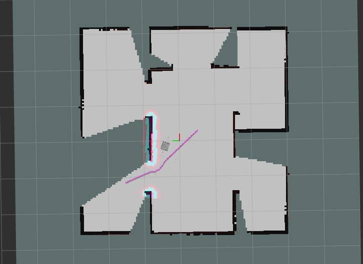

[](https://travis-ci.org/kuwabaray/ros_rl_for_slam)
# Training a DQN model for robot exploration in ROS and Gazebo environment
This projecr is used for my gruduation design Deep Reinforcement Learning Based Autonomous Exploration in office Environments, it simulates `Rosbot` movement on Gazebo and trains a rainforcement learning model DQN.DQN model is mainly used for choose a frontiner as next exploration target.
The model formulation process can reference to this thesis [Deep Reinforcement Learning Supervised Autonomous Exploration in Office Environments](https://ieeexplore.ieee.org/abstract/document/8463213), the source code and frame mainly reference to [kuwabaray/ros_rl_for_slam](https://github.com/kuwabaray/ros_rl_for_slam)


## Package Description
* **dqn\_for\_slam**: Build a costume GYM enviroment using ROS and Gazebo api and also build a DQN model(Keras-rl2, Tensorflow)
* **rosbot\_description**: Based on [rosbot\_description](https://github.com/husarion/rosbot_description). turned off camera and Infrared for computational load and reduced friction. 
* **simulate\_robot\_rl**: The entry point of training launches all nodes
* **simulate\_map**: Map for simulation
* **slam\_gmapping**: Based on [slam\_gmapping](https://github.com/ros-perception/slam\_gmapping). Added the service and functions that clear a map and restart gmapping.

## Dependency
environment
* Ubuntu 20.04
* ROS Noetic
* miniconda

ros package
* geometry2
* slam_gmapping
* robot_localization
* navigation

find `requirements.yaml` to see all environment

## Usage
Start trainning process by runing the commod below in order.
FIXME: a lot of absloate path lies in `rl_worker.py` and `robot_rl_env.py`, fix it before running that
 ```bash
roslaunch simulation_map maze1_nogui.launch
roslaunch simulate_robot_rl simulate_robot.launch
roslaunch mynav pathplan.launch
python ./dqn_for_slam/dqn_for_slam/rl_worker.py
```
Trained models are saved to ~/dqn\_for\_slam/dqn\_for\_slam/models/

## Author
mail:nianfeifly@163.com

